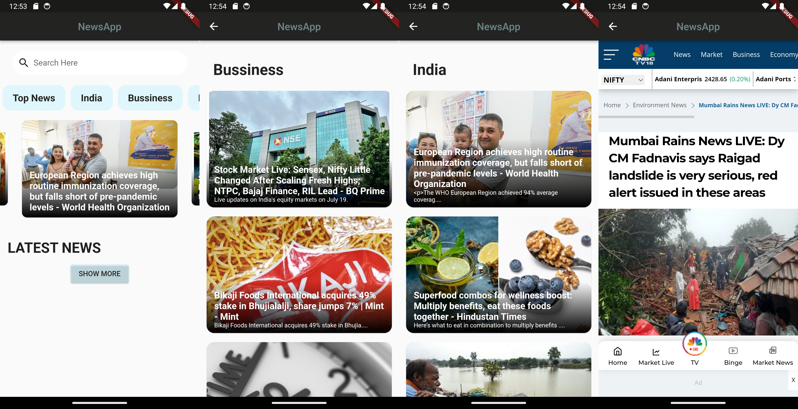

# News
The purpose of the project is to develop an application which will display news articles approved at backend. User can browse news articles through various categories. App will enable user to view news details.
  

 

### Flutter News App
Flutter News App with newsapi.org. Developed using the Test Driven Development.

### News App Features
  1) List daily news.
  2) Filter daily news by category.
  3) Search news
  4) Go to detail news website.

### Installation Steps
  1) Clone the repository.
  2) Open the terminal and type below commands to get dependancy
    <pre>
      flutter clean 
      flutter pub get 
      flutter pub upgrade 
      flutter run
    </pre>
  3) Go to [newsapi.org](newsapi.org) website and create an account. Get the API key and replace that in home.dart and category.dart files. 
  4) Your project is now ready to run !!

### Created By:-
[Priyanshu Patel ](https://github.com/priyanshu1044)

### Video Link
[NewsApp-Youtube]()
